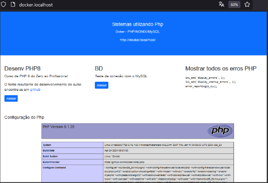
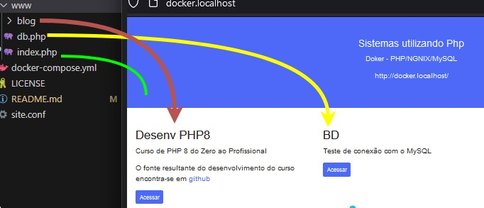

# Curso PHP8

```php
<?php

require_once 'honra.php';
echo 'Hello JRGGWorld!<br>';
echo greeting();

```

## Descrição
Este repositório e referente ao curso:

###Curso de PHP 8 
Aprenda tudo o que você precisa para ser um programador profissional em PHP

[YouTube](https://www.youtube.com/watch?v=O73xbQvGhHk&list=PL0N5TAOhX5E9eJ9Ix6YUIgEw3lNmaIEE9) | [ûdemy](https://www.udemy.com/course/curso-de-php-8-do-zero/?referralCode=AF873D0C1284D3461014)


## Para o curso, crei um ambiente Docker, contendo 3 imagens:
* nginx
* php8.1
* mysql:5.7

> [!NOTE]
> O Docker é apenas uma opção a qual escolhi, podemos utilizar o XAMPP, Wampserver, entre outros, o importante é ter um servidro Http, o PHP e o MySQL.

## Arquivos de configuração Docker
* docker-compose.yml
* site.conf

## Iniciar o Docker
```docker-compose up -d```

## Listar containers em execução  
```docker ps```

Deverá retornar isto para a configuração atual
```
CONTAINER ID   IMAGE          COMMAND                  CREATED       STATUS          PORTS                               NAMES
172968ef1dc8   nginx:latest   "/docker-entrypoint.…"   6 hours ago   Up 11 minutes   0.0.0.0:80->80/tcp                  nginx
218dd7c15556   php:8.1-fpm    "docker-php-entrypoi…"   6 hours ago   Up 11 minutes   9000/tcp                            php-fpm
ed0109d778cf   mysql:5.7      "docker-entrypoint.s…"   6 hours ago   Up 40 minutes   0.0.0.0:3306->3306/tcp, 33060/tcp   mysql
```

## Para testar no Browser
```http://docker.localhost/```



> [!NOTE]
> Cada projeto de PHP terá sua pasta dentro do www, a maneira de organizar e listar isto é ilustrado na imagem a seguir



## Necessário a instalação da extensão PDO para MySQL no PHP 
> [!IMPORTANT]
> Sem essa etapa o php não irá conseguir acessar o DB
```docker exec -it php-fpm docker-php-ext-install pdo pdo_mysql```
```docker-compose restart```

Depois disto já pode testar a conexão pelo browser:
```http://docker.localhost/db.php```

## Para acessar o bash de alguma delas: Ex.: php-fpm
```docker exec -it php-fpm bash```

Feito isto, se necessário instalar algo, como por exemplo o Vim, depois do comando anterior:
```
apt-get update
apt-get install vim
```

## Para saber o endereço ip de um container:
```docker inspect -f '{{range .NetworkSettings.Networks}}{{.IPAddress}}{{end}}' mysql```

Irá retornar por exempo:
```
>> 
172.19.0.2
```


## Conteúdo do curso
Seções | Aulas | Tempo 
-|-:|-:
1: Introdução	|	2	|	25m 
2: Fundamentos	|	36	|	5h 27m
3: Classes e Objetos	|	8	|	1h 13m
4: Composer	|	4	|	35m
5: Rotas	|	3	|	35m
6: Twig Template	|	1	|	1h 21m
7: PDO	|	16	|	2h 31m
8: CMS - Sistema de Gestão de Conteúdos	|	4	|	8h 16m
9: Classes Auxiliares e Utilitários	|	2	|	4h 50m
10: DataTable	|	8	|	1h 35m
11: Deploy - Domínio e Hospedagem	|	1	|	1h 36m
12: E-mails	|	7	|	1h 12m
13: Formulários com jQuery e Ajax	|	6	|	1h 23m
14: Painel do Usuário - EXTRA	|	12	|	1h 47m
